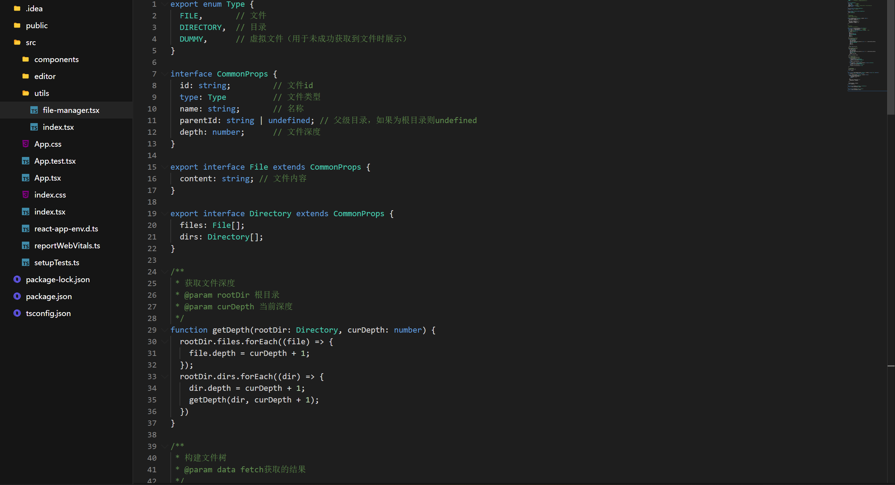

# 说明

本项目参考了[file-tree-live](https://codesandbox.io/s/file-tree-live-84jkx)的实现，但基本上对实现进行了完全的重构。

1. 使用typescript
2. 重定义了文件目录树的结构以及建树操作，使得结构更清晰
3. 弃用react-highlight，使用@monaco-editor/react
4. 启用react-ui，改用@emotion/styled
5. 修改图标方案


# 启动

```bash
npm install
npm start
```

或者您可以在[CodeSandbox](https://codesandbox.io/s/react-monaco-file-tree-ww9kis)中打开

# 运行截图

